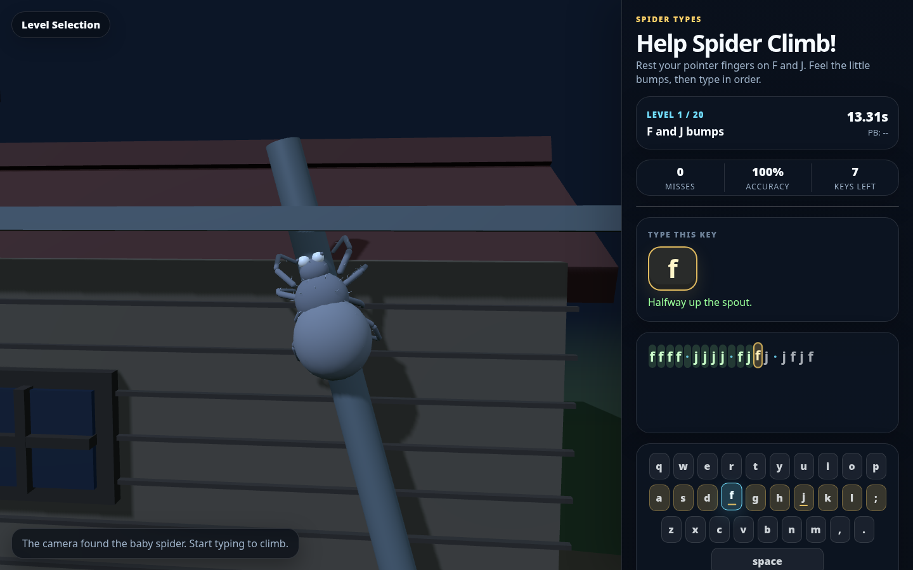
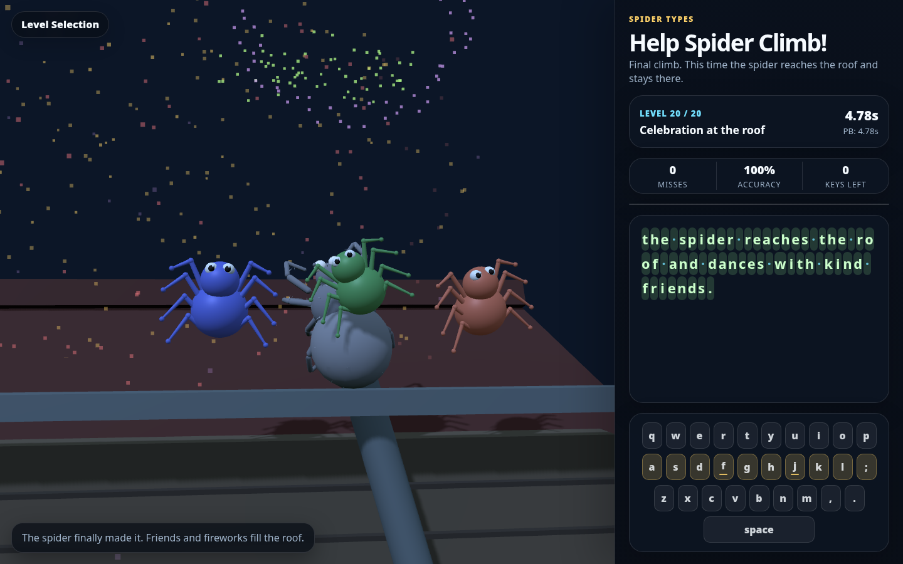

<h1 align="center">Spider Types</h1>

<p align="center">
  <b>A tiny typing game where kids help a baby spider climb.</b>
  <br />
  A self-hostable Three.js lesson game inspired by "Itsy Bitsy Spider", built for home-row practice, gentle pacing, and local-only progress.
  <br />
  Static web app · no backend · no accounts · no runtime network requests.
</p>

<p align="center">
  
  
  
  
  
  
</p>

---

## Screenshots

| Spider Types in action | Level 20 celebration |
|:---:|:---:|
|  |  |

---

## Quick start

### Prerequisites

- Node.js and npm
- A modern browser with WebGL support
- Audio enabled if you want the music box accompaniment

### Run locally

```bash
npm install
npm run dev
```

Open the local address printed by Vite, usually:

```text
http://localhost:5173
```

### First climb

1. Start at Level 1, or use **Level Selection** to pick an unlocked level.
2. Wait for the camera intro, or press **Skip Intro**.
3. Type the highlighted key or lesson text.
4. Correct keys help the spider climb. Mistakes make the spider slip.
5. Finish a level to retry, continue, or return to level selection.

---

## Host it yourself

Build the static bundle:

```bash
npm install
npm run build
```

Upload the generated `dist/` directory to any static web host. The shipped game does not require Node, npm, a server database, or any API at runtime.

---

## Gameplay

| Part | Details |
|---|---|
| **Lesson path** | 20 levels progress from F/J bump practice to full kid-friendly sentences. |
| **Typing guide** | A Mavis Beacon-style keyboard highlights home-row keys, F/J bumps, and the current target. |
| **Spider climb** | A Three.js baby spider climbs a slanted water spout as the player types accurately. |
| **Level endings** | Levels 1-19 end with rain washing the spider down. Level 20 ends with roof friends and fireworks. |
| **Music** | A Tone.js Itsy Bitsy Spider music box starts from the first typed key and stops when the level ends. |
| **Progress** | Best times and unlocked levels are saved in this browser only. |

---

## Features

- **Home-row curriculum** - F/J bump drills, left-hand and right-hand home-row practice, spaces, punctuation, and full sentences.
- **Interactive 3D scene** - Torn-roof house, slanted spout, rain washout, sun, friends, fireworks, and a bundled local spider model.
- **Typing feedback** - Current key, remaining keys, accuracy, misses, timer, personal best, and progress bar.
- **Level selection** - Choose unlocked climbs and clear saved scores from inside the game.
- **Offline-first runtime** - No accounts, analytics, cookies, service workers, remote assets, or API calls.
- **Static deployment** - Build once and serve the `dist/` folder from any plain static host.

---

## Privacy and saved data

Spider Types stores progress only in browser `localStorage` under:

```text
itsy-bitsy-spider-home-row:v1
```

Use **Level Selection** -> **Clear Saved Scores** inside the game to reset local progress.

Runtime privacy constraints:

| Area | Behavior |
|---|---|
| **Network** | No runtime network requests. The game is fully client-side. |
| **Assets** | The spider GLB is bundled locally at `public/models/spider.glb`. |
| **Scores** | Stored only in this browser with `localStorage`. |
| **Accounts** | None. |
| **Analytics** | None. |
| **Cookies** | None. |

---

## Tech stack

- **Vanilla JavaScript** - ES modules, no framework, no TypeScript.
- **Vite** - Local dev server and static production bundling.
- **Three.js 0.165.0** - 3D scene, camera, lighting, animation, and GLB loading.
- **Tone.js 15.x** - Browser music box and key feedback sounds.
- **Browser localStorage** - Per-level best times and unlock state.

### Toolchain

| Command | Purpose |
|---|---|
| `npm run dev` | Start the Vite dev server. |
| `npm run build` | Build the static bundle into `dist/`. |
| `npm run preview` | Serve the built bundle locally. |

### Project layout

| Path | Purpose |
|---|---|
| `index.html` | App shell and DOM for the scene, lesson panel, keyboard, and modals. |
| `src/main.js` | Main game loop, levels, Three.js world, input handling, UI state, and persistence. |
| `src/spiderMusicBox.js` | Tone.js Itsy Bitsy Spider music box. |
| `src/styles.css` | All application styling. |
| `public/models/spider.glb` | Bundled local spider model. |
| `assets/screenshots/` | README screenshots. |

---

## Development notes

This repository intentionally keeps the game small:

- No backend.
- No framework.
- No CDN or vendored libraries.
- No code generation step.
- No test suite, linter, typechecker, or CI.

Verification is manual: run `npm run dev`, open the game in a browser, and play the affected level.

---

## License

Licensed under the **GNU General Public License v3.0 only** (`GPL-3.0-only`) - see [`LICENSE`](LICENSE) for the full text.
